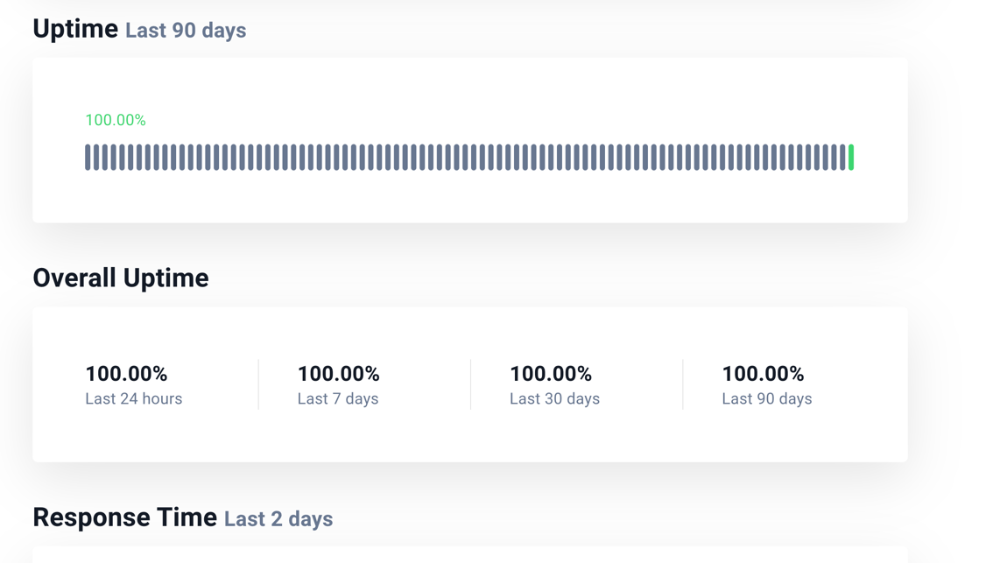
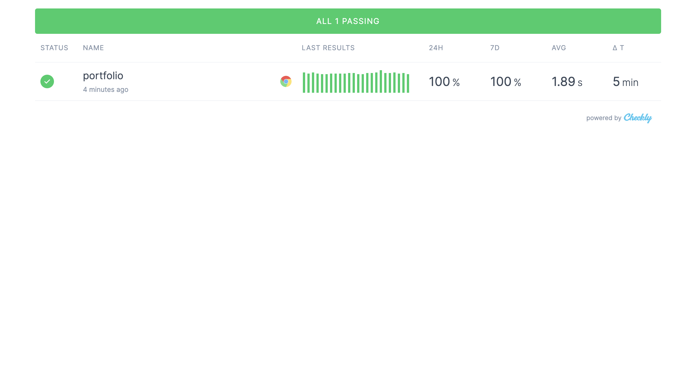

# My personal portfolio and blog

This repo contains the source code for [shramko.dev](https://shramko.dev). - in progress

*Readme is also available in [Ukrainian](README.ua.md).*

## Description

- [Next.js](https://nextjs.org/) - because it is evolving quickly, suits both developers and product needs, and has an amazing support
- [markdown](https://www.markdownguide.org/) - because it is easy to use and widespread
- [markdown-to-jsx](https://probablyup.com/markdown-to-jsx/) - adds more flexibility to md allowing us to integrate complex custom React components in it
- [github actions](https://github.com/features/actions) - simple CI variant
- [Checkly](https://www.checklyhq.com/) - API & E2E monitoring platform for the modern stack making CI easier than ever before
- [Snyk](https://snyk.io/) - finds and automatically fix vulnerabilities in your code, open source dependencies, containers, and infrastructure as code.
- [SWR](https://swr.vercel.app/) - implementation strategy stale-while-revalidate
- [Prisma](https://www.prisma.io/) - simple and intuitive TypeScript ORM and Database Client.
- [Uptimerobot](https://uptimerobot.com/) - uptime monitoring service. Use it for Connection checks 

## Monitors
- [Status page](https://stats.uptimerobot.com/8lYYzuXNM9/792406216) - lifetime checker for my portfolio uptime 

- [Dashboard](https://portfolio-shramko.checklyhq.com/) this is where I run E2E tests and check image statuses 

## License
This app is an open source project released under the [MIT License](https://github.com/Shramkoweb/Portfolio/blob/develop/LICENSE).
