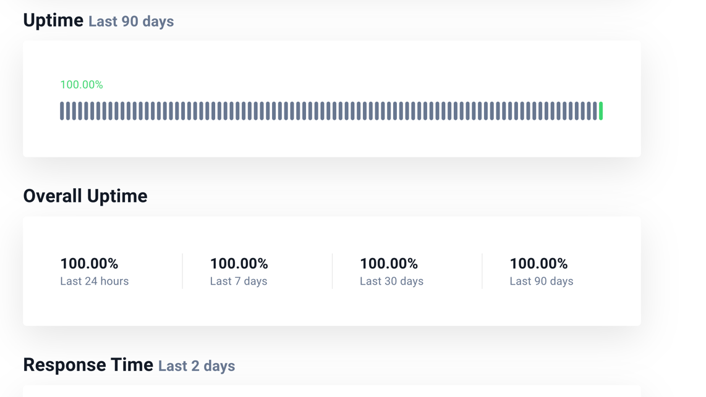
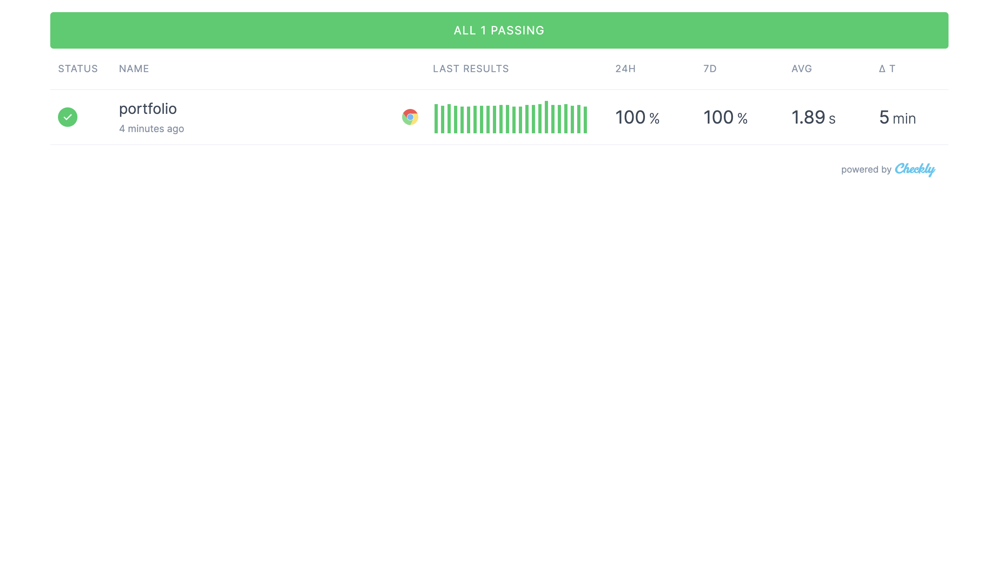

<h1 align="center">shramko.dev</h1>
<p align="center">Portfolio · blog · digital garden</p>
<p align="center"><a href="https://shramko.dev"><strong>Live demo →</strong></a></p>

<p align="center">
  <a href="https://github.com/Shramkoweb/Portfolio/actions/workflows/ci.yml"></a>
  <a href="https://github.com/Shramkoweb/Portfolio/actions/workflows/lighthouse.yml"></a>
  <a href="https://codeclimate.com/github/Shramkoweb/Portfolio/maintainability"></a>
  <a href="https://codeclimate.com/github/Shramkoweb/Portfolio/test_coverage"></a>
  
</p>

<p align="center"><a href="README.ua.md">Українською</a></p>

## Contents

- [Tech Stack](#tech-stack)
- [Getting Started](#getting-started)
- [Scripts](#scripts)
- [Testing](#testing)
- [Deployment](#deployment)
- [Monitors](#monitors)
- [Contributing](#contributing)
- [License](#license)

## Tech Stack

| Layer         | Tools                                                          |
| ------------- | -------------------------------------------------------------- |
| Framework     | Next.js 16, React 19                                           |
| Language      | TypeScript                                                     |
| Styling       | Tailwind CSS v4                                                |
| Content       | MDX, `next-mdx-remote`, Shiki                                  |
| Data          | Prisma 7, Postgres                                             |
| State / Fetch | SWR                                                            |
| Monitoring    | Sentry, Checkly, UptimeRobot, Vercel Analytics, Speed Insights |
| Testing       | Jest, Testing Library                                          |
| Tooling       | oxlint, oxfmt, commitlint, pnpm                                |
| Hosting       | Vercel                                                         |

## Getting Started

### Prerequisites

- Node 24.x
- pnpm 10.x
- Postgres database (local or hosted, e.g. [Neon](https://neon.tech))

### Setup

```bash
git clone https://github.com/Shramkoweb/Portfolio.git
cd Portfolio
pnpm install
cp .env.example .env
# fill in DATABASE_URL, SENTRY_*, GITHUB_TOKEN
pnpm dev
```

App runs at http://localhost:3000.

## Scripts

| Command                             | Purpose                    |
| ----------------------------------- | -------------------------- |
| `pnpm dev`                          | start dev server           |
| `pnpm build`                        | production build + sitemap |
| `pnpm start`                        | start production server    |
| `pnpm lint` / `pnpm lint:fix`       | oxlint                     |
| `pnpm format` / `pnpm format:check` | oxfmt                      |
| `pnpm test` / `pnpm test:coverage`  | Jest                       |
| `pnpm article`                      | scaffold a new blog post   |

## Testing

Tests use Jest with Testing Library. Run `pnpm test` for the full suite or `pnpm test:coverage` for a coverage report. Tests live in `__tests__/`. CI uploads coverage to Code Climate.

## Deployment

Deploys automatically to [Vercel](https://vercel.com) on push to `main`. The `postbuild` script regenerates the sitemap via `next-sitemap`. Pull requests run a Lighthouse budget check defined in `.github/workflows/lighthouse.yml`.

## Monitors

- [UptimeRobot status page](https://stats.uptimerobot.com/8lYYzuXNM9/792406216) — public uptime monitor for the live site.

  

- [Checkly dashboard](https://portfolio-shramko.checkly-dashboards.com/?duration=30d) — E2E tests and build status.

  

## Contributing

- Commits follow [Conventional Commits](https://www.conventionalcommits.org) (Angular convention). Enforced by `commitlint.config.ts`.
- A pre-commit hook auto-formats staged JS/TS via `oxfmt` (installed by `pnpm install` through the `prepare` script).
- Run `pnpm pre-push` before pushing — it runs lint and format checks.

## License

MIT — see [LICENSE](LICENSE).
