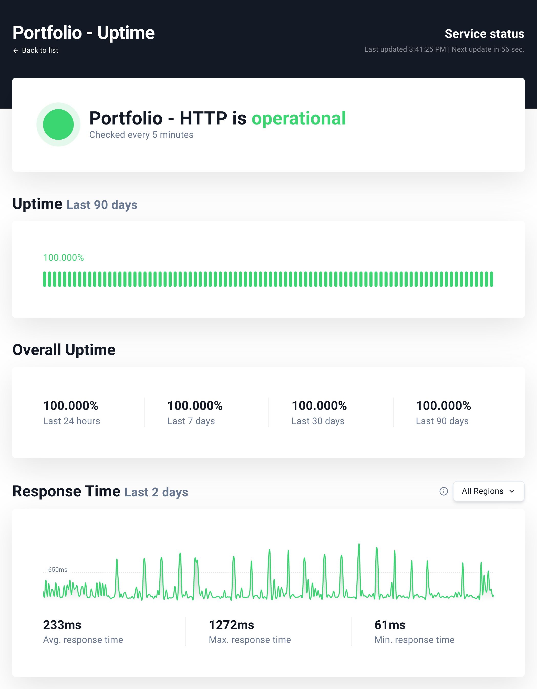
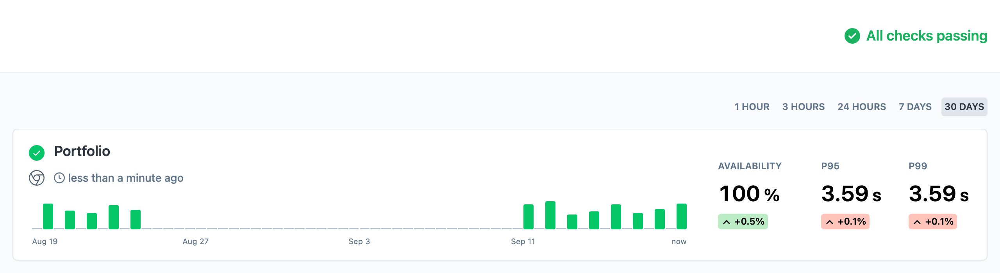

<h1 align="center">shramko.dev</h1>
<p align="center">Portfolio · blog · digital garden</p>
<p align="center"><a href="https://shramko.dev"><strong>Live demo →</strong></a></p>

<p align="center">
  <a href="https://github.com/Shramkoweb/Portfolio/actions/workflows/ci.yml"></a>
  <a href="https://github.com/Shramkoweb/Portfolio/actions/workflows/lighthouse.yml"></a>
  <a href="https://qlty.sh/gh/Shramkoweb/projects/Portfolio"></a>
  <a href="https://qlty.sh/gh/Shramkoweb/projects/Portfolio"></a>
  
</p>

## Contents

- [Tech Stack](#tech-stack)
- [Getting Started](#getting-started)
- [Scripts](#scripts)
- [Testing](#testing)
- [Deployment](#deployment)
- [Monitors](#monitors)
- [Contributing](#contributing)
- [License](#license)

## Tech Stack

| Layer         | Tools                                                          |
| ------------- | -------------------------------------------------------------- |
| Framework     | Next.js 16, React 19                                           |
| Language      | TypeScript                                                     |
| Styling       | Tailwind CSS v4                                                |
| Content       | MDX, `next-mdx-remote`, Shiki                                  |
| Data          | Prisma 7, Postgres                                             |
| State / Fetch | SWR                                                            |
| Monitoring    | Sentry, Checkly, UptimeRobot, Vercel Analytics, Speed Insights |
| Testing       | Jest, Testing Library                                          |
| Tooling       | oxlint, oxfmt, commitlint, pnpm                                |
| Hosting       | Vercel                                                         |

## Getting Started

### Prerequisites

- Node 24.x (see [`.nvmrc`](.nvmrc))
- pnpm — the exact version is pinned in the `packageManager` field of [`package.json`](package.json); `corepack` picks it up automatically
- Postgres database (local or hosted, e.g. [Neon](https://neon.tech))

### Setup

```bash
git clone https://github.com/Shramkoweb/Portfolio.git
cd Portfolio
pnpm install
cp .env.example .env
# fill in DATABASE_URL, SENTRY_*, GITHUB_TOKEN
pnpm dev
```

App runs at http://localhost:3000.

## Scripts

| Command                             | Purpose                                   |
| ----------------------------------- | ----------------------------------------- |
| `pnpm dev`                          | start dev server                          |
| `pnpm build`                        | production build + sitemap                |
| `pnpm start`                        | start production server                   |
| `pnpm lint` / `pnpm lint:fix`       | oxlint                                    |
| `pnpm format` / `pnpm format:check` | oxfmt                                     |
| `pnpm typecheck`                    | `tsc --noEmit`                            |
| `pnpm test` / `pnpm test:coverage`  | Jest                                      |
| `pnpm verify`                       | lint + format:check + typecheck + test:ci |
| `pnpm verify:full`                  | `verify` + production build               |
| `pnpm deps:audit`                   | `pnpm audit` on prod deps, high and above |
| `pnpm csp:check`                    | CSP covers the build's inline scripts     |
| `pnpm clean`                        | remove `.next/` and `coverage/`           |
| `pnpm article`                      | scaffold a new blog post                  |

## Testing

Tests use Jest with Testing Library. Run `pnpm test` for the full suite or `pnpm test:coverage` for a coverage report.

Unit tests sit next to the code they cover (`components/**/*.test.tsx`, `lib/**/*.test.ts`); page-level and API-route tests live in `__tests__/`.

Coverage is collected on every run, scoped by `collectCoverageFrom` in `jest.config.js` to the logic layer — `lib/`, `pages/api/` and `middleware.ts`. Presentational pages and components render in the test suite but are not counted, so the number reports how well the logic is exercised rather than how much JSX was touched. Thresholds are enforced on that scope: Jest exits non-zero below 85% statements / 75% branches / 80% functions / 85% lines. CI publishes `coverage/lcov.info` to [Qlty](https://qlty.sh/gh/Shramkoweb/projects/Portfolio), which backs the coverage badge above.

## Deployment

Deploys automatically to [Vercel](https://vercel.com) on push to `main`. The `postbuild` script regenerates the sitemap via `next-sitemap`.

Every push and pull request runs `.github/workflows/ci.yml` — `lint`, `typecheck`, `test` and `audit` in parallel, plus a full `build` on pull requests, which also runs `csp:check`. Pull requests additionally run a Lighthouse budget check defined in `.github/workflows/lighthouse.yml`.

## Monitors

- [UptimeRobot status page](https://stats.uptimerobot.com/8lYYzuXNM9/792406216) — public uptime monitor for the live site.

  

- [Checkly dashboard](https://portfolio-shramko.checkly-dashboards.com/?duration=30d) — E2E tests and build status.

  

## Contributing

- Commits follow [Conventional Commits](https://www.conventionalcommits.org) (Angular convention). Enforced by `commitlint.config.ts`.
- A pre-commit hook auto-formats staged JS/TS via `oxfmt` (installed by `pnpm install` through the `prepare` script).
- A pre-push hook (`.git-hooks/pre-push`) runs `pnpm verify` automatically before each push. Run `pnpm verify:full` (adds `next build`) before opening a PR.
- See [AGENTS.md](AGENTS.md) if you're using an AI coding agent. Full policy in [CONTRIBUTING.md](CONTRIBUTING.md).

## License

MIT — see [LICENSE](LICENSE).
