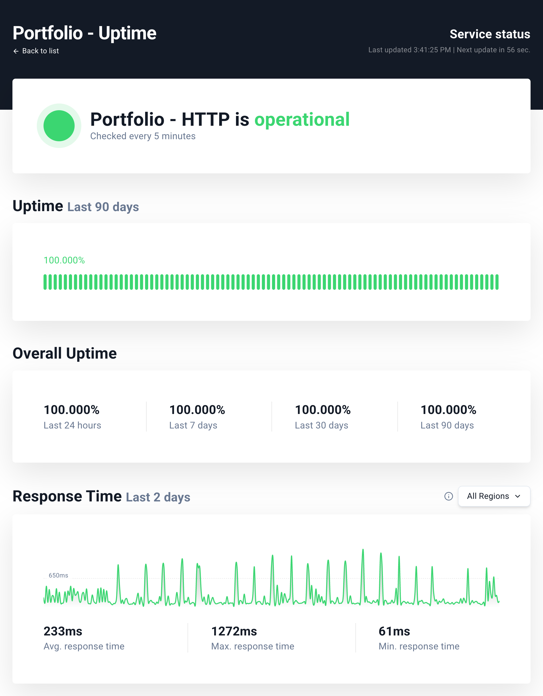
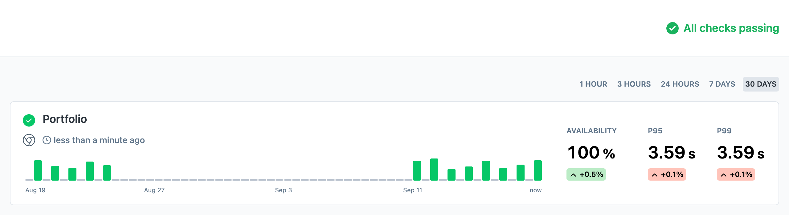

<h1 align="center">shramko.dev</h1>
<p align="center">Portfolio · blog · digital garden</p>
<p align="center"><a href="https://shramko.dev"><strong>Visit the site →</strong></a></p>

<p align="center">
  <a href="https://github.com/Shramkoweb/Portfolio/actions/workflows/ci.yml"></a>
  <a href="https://github.com/Shramkoweb/Portfolio/actions/workflows/lighthouse.yml"></a>
  <a href="https://qlty.sh/gh/Shramkoweb/projects/Portfolio"></a>
  <a href="https://qlty.sh/gh/Shramkoweb/projects/Portfolio"></a>
  <a href="LICENSE"></a>
</p>

My personal site: long-form posts, a copy-paste snippet library, and the notes-in-public
part of a digital garden. One Next.js app, one deployment target, no CMS — content is MDX
in the repo, so a post ships through the same pipeline as a code change.

## What's inside

| Area           | Notes                                                                                                                   |
| -------------- | ----------------------------------------------------------------------------------------------------------------------- |
| Blog           | MDX posts with category pages, reading time, a table of contents and Shiki-highlighted code                             |
| Snippets       | Short copy-paste MDX snippets under `/snippets`                                                                         |
| Garden pages   | `/bookmarks`, `/learning`, `/gear` — curated lists that get edited rather than versioned as posts                       |
| Dashboard      | `/dashboard` aggregates total page views (Postgres) and GitHub stars/followers behind one cached API route              |
| Engagement     | Per-slug view counter and heart / beer / trophy reactions, both backed by Prisma + Postgres                             |
| Social images  | OG images rendered on the edge by `@vercel/og` at `/api/og`                                                             |
| Syndication    | RSS at [`/feed.xml`](https://shramko.dev/feed.xml), sitemap generated by `next-sitemap`, JSON-LD on content pages       |
| AI readability | Hand-maintained [`llms.txt`](public/llms.txt) / [`llms-full.txt`](public/llms-full.txt) for assistants that are welcome |
| Side projects  | Landing pages for my browser extensions                                                                                 |

## Tech Stack

| Layer         | Tools                                                                   |
| ------------- | ----------------------------------------------------------------------- |
| Framework     | Next.js (Pages Router), React                                           |
| Language      | TypeScript (strict)                                                     |
| Styling       | Tailwind CSS, `@tailwindcss/typography`, `next-themes` for dark mode    |
| Content       | MDX via `next-mdx-remote`, Shiki for syntax highlighting, `gray-matter` |
| Data          | Prisma with `@prisma/adapter-pg`, Postgres (Neon in production)         |
| State / Fetch | SWR                                                                     |
| Monitoring    | Sentry, Checkly, UptimeRobot, Vercel Analytics, Speed Insights          |
| Testing       | Jest, Testing Library, Playwright (Chromium)                            |
| Tooling       | oxlint, oxfmt, commitlint, Renovate, pnpm                               |
| Hosting       | Vercel                                                                  |

Versions are pinned in [`package.json`](package.json).

## Getting Started

### Prerequisites

- Node, at the version in [`.nvmrc`](.nvmrc)
- pnpm — the exact version is pinned in the `packageManager` field of [`package.json`](package.json); `corepack` picks it up automatically
- Postgres database (local or hosted, e.g. [Neon](https://neon.tech)) — only needed for the view counter, reactions and dashboard

### Setup

```bash
git clone https://github.com/Shramkoweb/Portfolio.git
cd Portfolio
pnpm install          # postinstall runs `prisma generate`
cp .env.example .env
pnpm dev
```

App runs at http://localhost:3000.

Every variable is documented inline in [`.env.example`](.env.example), including where to
obtain it. None are required to browse the site locally — `DATABASE_URL` powers the view
counter, reactions and dashboard, `GITHUB_TOKEN` powers the GitHub stats card, and the
Sentry variables only matter for production builds.

## Project layout

| Path            | Purpose                                                       |
| --------------- | ------------------------------------------------------------- |
| `pages/`        | Routes and API endpoints (`pages/api/`)                       |
| `components/`   | Shared React components, with unit tests alongside them       |
| `lib/`          | Utilities, JSON-LD schema, GitHub/feed helpers, bot blocklist |
| `_posts/`       | Blog post MDX sources                                         |
| `_snippets/`    | Code-snippet MDX sources                                      |
| `public/`       | Static assets, post images, `robots.txt`, `llms.txt`          |
| `prisma/`       | Schema and migrations                                         |
| `__tests__/`    | Page-level and API-route tests                                |
| `tests/visual/` | Playwright behavior and visual regression tests               |
| `styles/`       | Global CSS and Tailwind directives                            |

## Scripts

| Command            | Purpose                                    |
| ------------------ | ------------------------------------------ |
| `pnpm dev`         | start the dev server                       |
| `pnpm verify`      | lint + format:check + typecheck + test:ci  |
| `pnpm verify:full` | `verify` + production build                |
| `pnpm verify:all`  | `verify:full` + all Playwright tests       |
| `pnpm test:visual` | local Playwright behavior and visual tests |
| `pnpm article`     | scaffold a new blog post                   |

The rest (formatting, linting, coverage, audits, CSP check) is in the `scripts` field of
[`package.json`](package.json).

`pnpm verify` is the fast loop and what the pre-push hook runs. `pnpm verify:full` adds
`next build` and is what CI effectively reproduces — run it before opening a PR.
`pnpm verify:all` runs every local check, including Jest with coverage, the
production build, and all Playwright behavior and visual regression tests. Install
Chromium first as described below; the command stops on the first failed step.

## Testing

Unit, component and API tests use Jest with Testing Library. Run `pnpm test` for
the Jest suite or `pnpm test:coverage` for a coverage report. Run `pnpm verify:all`
to include the Playwright suite and all build and static checks.

Unit tests sit next to the code they cover (`components/**/*.test.tsx`, `lib/**/*.test.ts`);
page-level and API-route tests live in `__tests__/`.

Coverage is collected on every run, scoped by `collectCoverageFrom` in `jest.config.js` to
the logic layer — `lib/`, `pages/api/` and `middleware.ts`. Presentational pages and
components render in the test suite but are not counted, so the number reports how well the
logic is exercised rather than how much JSX was touched. Jest exits non-zero when coverage
on that scope drops below the thresholds set in `jest.config.js`.
CI publishes `coverage/lcov.info` to [Qlty](https://qlty.sh/gh/Shramkoweb/projects/Portfolio),
which backs the coverage badge above.

### Local visual regression tests

Install Chromium once, then run the local harness:

```bash
pnpm exec playwright install chromium
pnpm test:visual
pnpm test:visual:report
```

Playwright builds and starts an isolated production server on port 3100 using
`.next-visual/`. No database, API credentials, Docker or CI setup is required.
Browser API requests use fixtures; external requests are blocked. Dates are fixed
in prerendering and the browser. Runtime errors fail the tests.

The harness covers behavior and UI states, not full-page screenshots of content. Visual
baselines capture small UI regions on mobile and desktop, in light and dark themes, plus
the Open Graph images. Behavior tests exercise interactive flows such as search, theme
switching, sharing, reactions and API loading and error states. Backend API validation
stays in the Jest suite. The specs in [`tests/visual/`](tests/visual) are the full list.

For a shorter feedback loop, select a project, file or test:

```bash
pnpm test:visual --project=chromium-mobile-dark
pnpm test:visual content.spec.ts
pnpm test:visual --grep 'optimistic reaction'
pnpm test:visual --ui
```

Baselines live in `tests/visual/__screenshots__`, separated by operating system
and project because system fonts differ. The checked-in baselines were generated
on macOS with the pinned Chromium version. On another OS, generate and review its
baselines first. Missing baselines fail ordinary runs; they are never silently
accepted. After an intentional UI change, update only the affected
screenshots and review the image diff before committing:

```bash
pnpm test:visual:update visual.spec.ts --grep 'copy control'
```

Commit baseline PNGs with the corresponding change. Reports, traces, actual and
diff images remain local in `playwright-report/` and `test-results/`. The visual
suite is included in `pnpm verify:all`. CI runs it on every pull request with
`--ignore-snapshots`: behavior tests run on Linux, while screenshot comparison
stays local because the baselines are macOS-only.

## Security

- **Response headers** — CSP, HSTS with preload, `X-Frame-Options: DENY`, `nosniff`,
  `Referrer-Policy` and a `Permissions-Policy` that denies camera, microphone and
  geolocation. All defined in [`next.config.js`](next.config.js).
- **CSP drift check** — the production CSP allow-lists inline scripts by hash.
  `pnpm csp:check` compares those hashes against the built output and runs in CI on every
  pull request, so a new inline script can't silently ship behind a stale policy.
- **AI crawler policy** — training and scraping crawlers are declined in
  [`robots.txt`](public/robots.txt) and get a 403 from edge middleware. Search engines,
  AI search, link previews and assistants fetching a page for a user are allowed. The
  middleware list lives in [`lib/bot-blocklist/tokens.ts`](lib/bot-blocklist/tokens.ts),
  and a test fails if `robots.txt` drifts from it. The Vercel firewall bypass rule for
  readers is kept in [`vercel-readers.json`](lib/bot-blocklist/vercel-readers.json) and
  applied in the Vercel dashboard, not by a deploy.
- **Supply chain** — Renovate opens dependency PRs on the schedule in
  [`renovate.json`](renovate.json), auto-merging small updates and leaving larger ones for
  review. A production dependency audit runs as its own CI job.
- **Scanning** — GitHub secret scanning and CodeQL are enabled on the repo.

Vulnerability reports go through the process in [SECURITY.md](SECURITY.md) — please don't
open a public issue.

## Performance budget

Lighthouse CI audits every Vercel preview deployment against
[`.github/lighthouse-budget.json`](.github/lighthouse-budget.json), which sets budgets for
Core Web Vitals timings and for script, stylesheet and total size. The audited pages and
the number of runs are set in [`lighthouse.yml`](.github/workflows/lighthouse.yml), and the
results are posted back to the pull request as a table.

## Deployment

Deploys automatically to [Vercel](https://vercel.com) on push to `main`. The `postbuild`
script regenerates the sitemap via `next-sitemap`.

[`.github/workflows/ci.yml`](.github/workflows/ci.yml) runs lint, type checks, tests and a
dependency audit on every push to `main` and every pull request. Pull requests also build
the site, check the CSP hashes and run the Playwright suite with screenshot comparison
off. Test coverage goes to Qlty over OIDC.

[`.github/workflows/lighthouse.yml`](.github/workflows/lighthouse.yml) is triggered by a
successful Vercel **Preview** deployment rather than by the push itself, so it audits the
real deployed preview instead of a local build.

## Monitors

- [UptimeRobot status page](https://stats.uptimerobot.com/8lYYzuXNM9/792406216) — public uptime monitor for the live site.

  

- [Checkly dashboard](https://portfolio-shramko.checkly-dashboards.com/?duration=30d) — browser check and availability over the last 30 days.

  

## Writing a post

`pnpm article` scaffolds `_posts/<slug>.md` with the frontmatter the build expects.
Categories must already exist in the `PostCategory` enum in `lib/types.ts`, images go in
`public/static/images/`, and `public/llms.txt` and `public/llms-full.txt` are updated by
hand. Illustrations follow one hand-drawn house style. The full checklist, the
illustration guide and the failure modes that don't surface until build time live in
[AGENTS.md](AGENTS.md).

## Contributing

- Commits follow [Conventional Commits](https://www.conventionalcommits.org) (Angular convention). Enforced by `commitlint.config.ts`.
- A pre-commit hook auto-formats staged JS/TS via `oxfmt` (installed by `pnpm install` through the `prepare` script).
- A pre-push hook (`.git-hooks/pre-push`) runs `pnpm verify` automatically before each push. Run `pnpm verify:full` (adds `next build`) before opening a PR.
- See [AGENTS.md](AGENTS.md) if you're using an AI coding agent. Full policy in [CONTRIBUTING.md](CONTRIBUTING.md).

## License

MIT — see [LICENSE](LICENSE).
